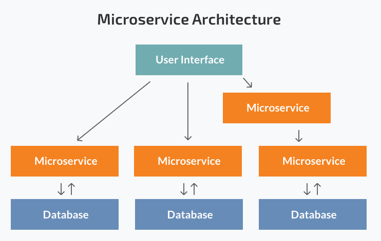
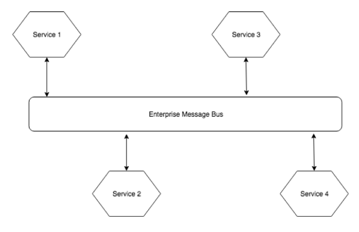
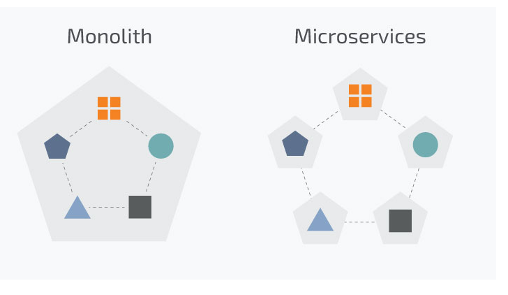
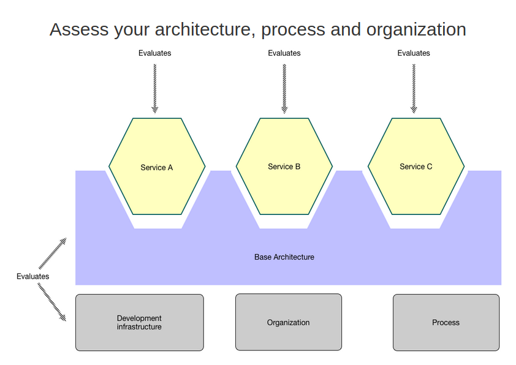
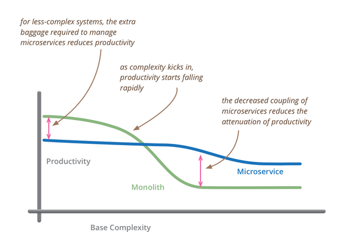

# Notion of Microservices Architecture

## Overview

Enterprises demanded their product to launch before any other enterprise does but as the matter of larger, sophisticated & complex
product had only one option of to work in a monolithic style that cause a problem of slow development which leads to delay the product to be in production in a right time. Also adoption of microservices architecture can be more complex, these obstacle require to tackle problem enhanced strategically, maintenance and hardware.   

## What is Microservices?

Microservices is a structure that follows simple rule of divide and rule technique to build single model for this progress enterprise relying  on Agile and more towards DevOps for testing. 

1. Microservices – is also called microservices architecture which follows pattern as follows:
    • Highly need to sustained the system 
    • Loosely coupled 
    • Small group to handle 
    • Can be deployed independently	
    • High-end system required
    • To serve business capabilities 
      
2.  Enables to handle complex, frequent changes easily

### Benefits

Microservices architecture is good for many business application. As we rebate from it due these reasons.
  
1. As each service comprised of container  maintained mainly with Kubernetes bearing image from docker is very small
2. Accumulates  ease of  to deployment independently
3. A small team can handle the production
4. Updates can be achieved without going under maintenance.
5. The phenomenon of microservices is “Decentralization”
6. Different services written in different language but it is not recommended by professionals
7.  Ease in integration to scale up third-party options. 

 

### Flaws

It is not golden key to address all problems although it has some demerits which needs to address utterly.
1. Before to apply this architecture it is need to examine it considerably whether the microservices architecture is fair for your application where no high risk of security needed. As like numerous &  populous social media apps inclusively Tiktok, facebook, twitter adopted microservices architecture or semi adoption with combination of Monolithic Architecture.
2. Although it may have lesser maintenance breakdown of host as compered to monolithic architectures does.
3. A single service can be numerous which is not needed
4. Too increase in services that lacks the team to whirl do tackle team has to record everything
5.  Team or group has to put extravagant efforts to implement architectural pattern without sticking into a bug obvious it delays the product  to be in production  

### Fun fact of Monolithic Architecture

This is a traditional architecture can’t be obsolete till now as it provides lesser risk of security and can be maintained easily.
Thus,  a virtue of high risk intelligence agencies, banks and those places where data or money could be compromise.
This architecture follows server-side model which offers to entertain variety of different clients native, mobile or desktop browsers. 
  
#### Issues
    • Huge team there working on single application
    • Simplicity of code is essential for new comer
    • Take much time for maintenance of it as compared to microservices architecture

### Avoid potholes

As microservices architecture designed to coup with failure but there is always chance that it might crash at instance
is only possible where no accumulator available to sustained it.

### Enhancing Architecture
To enhance architecture

### Conclusion

It seems to be so clear that microservices is now and our future it has potential to eliminate numerous problems as we disscussed earlier.

What do you say microservices has  the potential  that will lead us or it just rant of developers who are the maker of it?

Leave a comment below I’ll read your comments 

## References

* [Microservices](https://www.n-ix.com/microservices-vs-monolith-which-architecture-best-choice-your-business/)

* [Benifits of microservices](https://medium.com/hashmapinc/the-what-why-and-how-of-a-microservices-architecture-4179579423a9)

* [Monolithic architecture](https://www.n-ix.com/microservices-vs-monolith-which-architecture-best-choice-your-business/)

* [Enhancing architecture](https://microservices.io/platform/microservice-architecture-assessment.html)

* [Microservice vs. monolithic architecture statistics](https://magora-systems.com/monolithic-architecture-vs-microservices/)